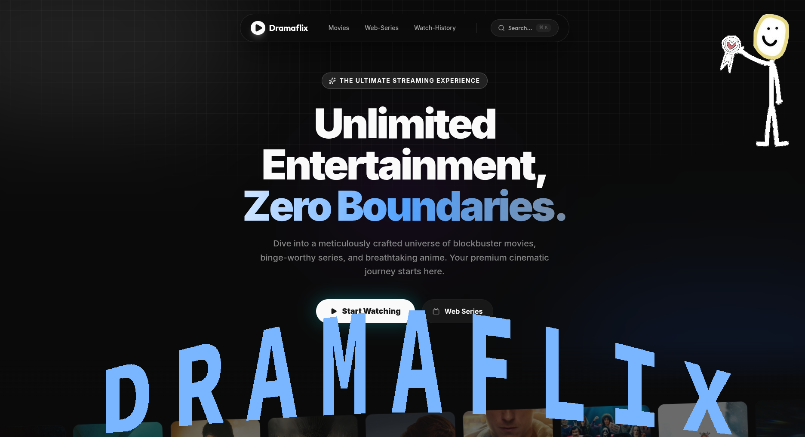

# Dramaflix

Modern Next.js app for browsing movie and TV metadata with external playback embeds. This repository is a frontend application only. It does not host or store any media files.




## What This App Does

- Fetches **metadata** (titles, overviews, cast, images, ratings) from TMDB
- Renders **external embeds** for playback inside iframes
- Stores watch history and playback progress **only in the browser** (localStorage)

## Data Sources & External Services (Full Transparency)

### Metadata & Images

- **TMDB API** (metadata): `https://api.themoviedb.org/3/`
- **TMDB Image CDN**: `https://image.tmdb.org/t/p/`

### Playback Embeds (used directly in UI)

These are hard-coded iframe sources used in the current UI:

- `https://embedmaster.link/<redacted>/movie/{id}`
- `https://embedmaster.link/<redacted>/tv/{seriesId}/{season}/{episode}`
- `https://vidsrc.vip/embed/movie/{id}`
- `https://vidsrc.vip/embed/tv/{seriesId}/{season}/{episode}`
- `https://vidsrc.icu/embed/movie/{id}`
- `https://vidsrc.icu/embed/tv/{seriesId}/{season}/{episode}`
- Download link in series episode page: `https://dl.vidsrc.vip/tv/{seriesId}/{season}/{episode}`

**Source files:**
- Movies: `src/components/movies-ui/movie-players.tsx`
- Series: `src/app/web-series/watch/[...slugs]/page.tsx`

### Optional Streaming Link Aggregation (present in code, not wired into UI)

There are server utilities that can fetch HLS sources and subtitles, but the current pages do not call them. These are present in:

- `src/utils/movie-requests/request.ts`
- `src/utils/tv-requests/request.ts`

They reference:

- **Consumet API** (configured via `CONSUMET_API_URL`):
  - `GET /meta/tmdb/info/{id}?type=movie|tv`
  - `GET /meta/tmdb/watch/{episodeId}?id={tmdbId}`
- **VidSrc link service** (hard-coded):
  - `https://dramaflix-movielinks.vercel.app/vidsrc/{tmdbId}`

### Proxies (optional)

The app can route image and HLS requests through proxies you control:

- `NEXT_PUBLIC_PROXY` (images)
- `NEXT_PUBLIC_PROXY_2` (images)
- `NEXT_PUBLIC_M3U8_PROXY` (HLS video)

### Browser Storage Only

- Watch history and playback progress are stored in **localStorage** only.
- No database is used.

**Source file:** `src/utils/localStorage.ts`

## Remote Image Allowlist

Next.js image remote patterns are configured in `next.config.mjs`. The allowlist includes:

```
image.tmdb.org
s4.anilist.co
media.kitsu.io
artworks.thetvdb.com
asianimg.pro
img.freepik.com
i.pinimg.com
cdn.myanimelist.net
sup-proxy.zephex0-f6c.workers.dev
gogocdn.net
m3u8proxy.zephex0-f6c.workers.dev
m3u8proxy.goodproxy.workers.dev
goodproxy.goodproxy.workers.dev
goodproxy.dramaflix.workers.dev
m3u8proxy.dramaflix.workers.dev
cdn.noitatnemucod.net
i.ytimg.com
```

## No Hosting / No Storage of Media

This repository contains **source code only**. It does not include or store video files. Playback, if used, is rendered from third‑party embeds.

## Environment Variables

Create `.env.local` in the project root:

```env
# Required for TMDB metadata
TMDB_API_KEY=your_tmdb_api_key_1,your_tmdb_api_key_2

# Optional image proxies
NEXT_PUBLIC_PROXY=https://your-image-proxy.example
NEXT_PUBLIC_PROXY_2=https://your-image-proxy.example

# Optional HLS proxy (used by custom players if wired in)
NEXT_PUBLIC_M3U8_PROXY=https://your-m3u8-proxy.example

# Optional streaming link aggregation (present in code, not wired in UI)
CONSUMET_API_URL=https://your-consumet-api.example
```

## Scripts

```bash
npm run dev
npm run build
npm run start
npm run lint
```

## Deployment

This is a standard Next.js app. Deploy it to any Node.js host (Vercel, Netlify, Render, etc.).

**Build command:** `npm run build`  
**Start command:** `npm run start`

## Legal & Usage Notes

- This app displays **metadata** from TMDB and renders **third‑party embeds** for playback.
- It does **not** host, upload, or store media files.
- You are responsible for ensuring any content you access through third‑party services is authorized in your jurisdiction and complies with those services’ terms.

## Project Structure (High Level)

```
src/
  app/                     # Next.js routes
  components/              # UI components
  utils/                   # API helpers, types, localStorage
```

## License

MIT (code only). See `LICENSE`.
